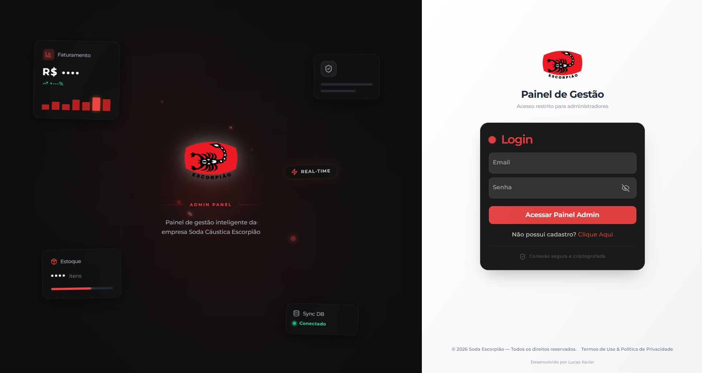
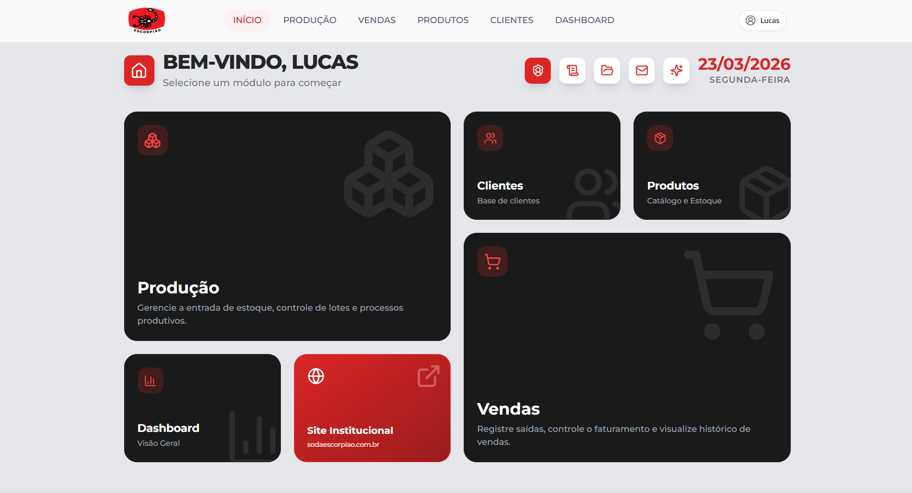
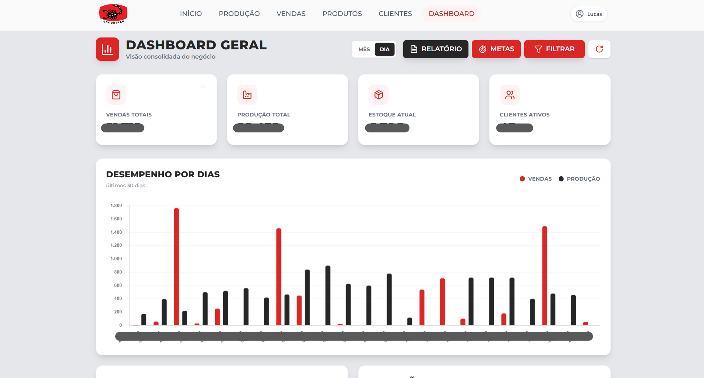
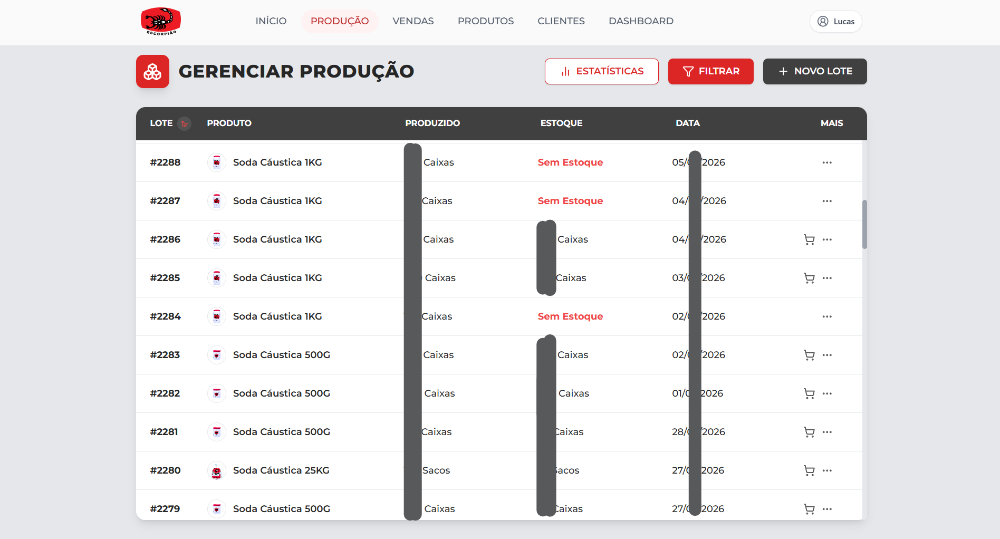
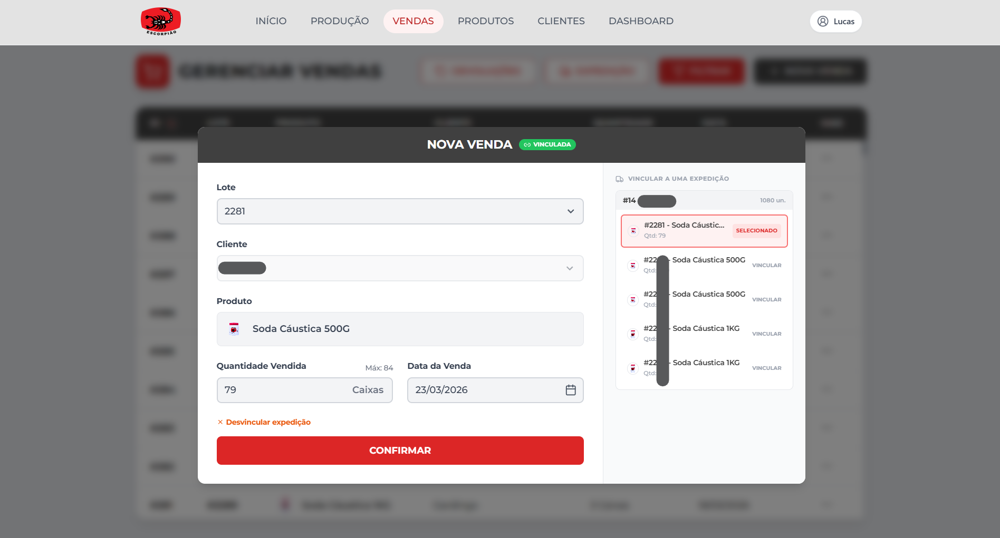
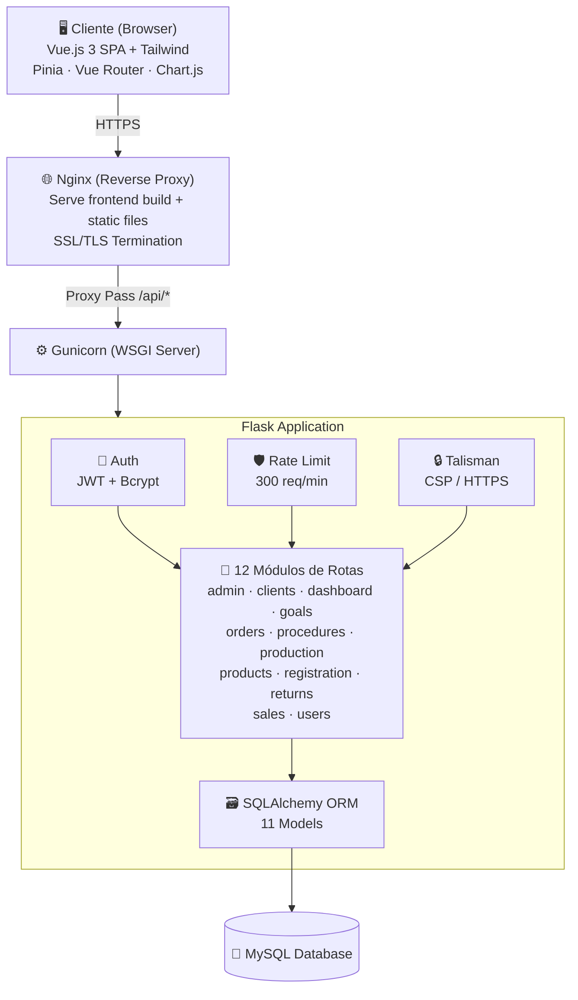

<p align="center">
  <h1 align="center">🦂 Fullstack Admin Dashboard</h1>
  <p align="center">
    Sistema administrativo fullstack completo, desenvolvido do zero — do backend à infraestrutura em produção.
    <br/>
    <strong>Vue.js · Flask · MySQL · Nginx · Gunicorn · VPS</strong>
  </p>
</p>

<p align="center">
  
  
  
  
  
  
</p>

---

> **⚠️ Repositório Showcase** — Esta é uma versão sanitizada de um sistema em **produção real**. Credenciais, variáveis de ambiente e configurações sensíveis foram removidas por segurança. O código está disponível **apenas para visualização e análise**.

---

## 📋 Sobre o Projeto

Sistema administrativo interno desenvolvido para gerenciar **toda a operação** de uma empresa — desde a produção e controle de estoque, passando por vendas e expedições, até dashboards analíticos com métricas de negócio.

Sistema **fullstack** pronto para produção com infraestrutura completa de backend, frontend e VPS.

**🌐 Projeto em produção:** [admin.sodaescorpiao.com.br](https://admin.sodaescorpiao.com.br)

### 📸 Preview

<table>
  <tr>
    <td align="center"><br/><sub>Tela de Login</sub></td>
    <td align="center"><br/><sub>Página Inicial</sub></td>
  </tr>
  <tr>
    <td align="center"><br/><sub>Dashboard</sub></td>
    <td align="center"><br/><sub>Produção</sub></td>
    <td align="center"><br/><sub>Vendas</sub></td>
  </tr>
</table>

---

## ✨ Funcionalidades

### 🔐 Autenticação & Autorização
- Login com JWT (JSON Web Tokens)
- Senhas criptografadas com Bcrypt
- Controle de acesso por níveis: **Usuário**, **Admin** e **Master**
- Route guards no frontend e middleware de proteção no backend

### 📦 Gestão de Produtos
- CRUD completo de produtos
- Upload e gerenciamento de imagens
- Unidades por caixa configuráveis

### 🏭 Controle de Produção
- Registro de lotes de produção com rastreamento por código de lote
- Cálculo dinâmico de estoque acumulado por produto
- Vínculo entre lotes e metas de produção

### 💰 Módulo de Vendas
- Registro de vendas vinculadas a lotes e clientes
- Desconto automático do estoque no ato da venda
- Controle de quantidade disponível por lote

### 📋 Gestão de Pedidos (Expedição)
- Criação e gerenciamento de pedidos de venda
- Vínculo de lotes específicos a cada pedido
- Status do pedido: **Pendente**, **Separado**, **Concluído**
- Controle de permissões para alteração de status

### 🔄 Devoluções
- Fluxo completo de devoluções em 3 etapas: **Aberto → Retornado → Concluído**
- Rastreamento do lote de origem e lote de destino
- Reversão automática de estoque

### 🎯 Metas de Produção
- Definição de metas com período (data início/fim)
- Associação de lotes de produção à meta
- Acompanhamento em tempo real do progresso

### 👥 Gestão de Clientes
- Cadastro de clientes com telefone
- Métricas automáticas: total de compras e total de caixas adquiridas

### 📊 Dashboard Analítico
- Gráficos interativos com **Chart.js**
- Métricas de produção, vendas e estoque
- Visão geral do negócio em tempo real

### 📄 Procedimentos (Documentos)
- Upload e gerenciamento de arquivos/documentos internos
- Controle de versão com timestamps de criação e atualização

### 📈 Histórico de Movimentações de Estoque
- Registro de toda movimentação (produção, venda, devolução)
- Rastreamento completo com referência de origem e tipo
- Auditoria de quem realizou cada movimentação

### 🔔 Sistema de Notificações/Updates
- Página dedicada para registro de atualizações do sistema

### 📱 Geração de Relatórios em PDF
- Exportação de dados com **jsPDF** + **AutoTable**

---

## 🛠️ Stack Tecnológica

### Frontend
| Tecnologia | Uso |
|---|---|
| **Vue.js 3** | Framework SPA com Composition API |
| **Vite 6** | Build tool e dev server |
| **Tailwind CSS 3** | Estilização utilitária |
| **Pinia** | Gerenciamento de estado global |
| **Vue Router 4** | Roteamento SPA com guards de autenticação |
| **Chart.js** + **vue-chartjs** | Gráficos e visualizações no dashboard |
| **jsPDF** + **jspdf-autotable** | Geração de relatórios PDF no client-side |
| **GSAP** | Animações e transições |
| **Lucide Icons** | Biblioteca de ícones |
| **jwt-decode** | Decodificação de tokens JWT no frontend |

### Backend
| Tecnologia | Uso |
|---|---|
| **Python / Flask 3.1** | Framework web e API REST |
| **Flask-SQLAlchemy** | ORM para modelagem e consultas ao banco de dados |
| **Flask-JWT-Extended** | Autenticação baseada em tokens JWT |
| **Flask-Bcrypt** | Hash seguro de senhas |
| **Flask-Limiter** | Rate limiting (300 req/min) |
| **Flask-Talisman** | Security headers e CSP (Content Security Policy) |
| **Flask-CORS** | Controle de CORS dinâmico (dev/prod) |
| **PyMySQL** | Driver de conexão com MySQL |

### Infraestrutura
| Tecnologia | Uso |
|---|---|
| **Linux (Ubuntu VPS)** | Servidor de produção |
| **Nginx** | Reverse proxy e servidor de arquivos estáticos |
| **Gunicorn** | WSGI HTTP Server para Flask |
| **MySQL** | Banco de dados relacional |

---

## 🏗️ Arquitetura



---

## 📂 Estrutura do Projeto

```
fullstack-admin-system-Showcase/
│
├── backend/
│   ├── __init__.py              # App factory (Flask, extensões, CORS, Talisman)
│   ├── config.py                # Configurações por ambiente (Dev/Prod)
│   ├── models.py                # 11 modelos SQLAlchemy
│   ├── jwt_helper.py            # Configuração e helpers JWT
│   ├── create_tables.py         # Script de criação de tabelas
│   ├── seed_admin.py            # Seed do usuário admin inicial
│   ├── run.py                   # Entrypoint da aplicação
│   ├── migrations/              # Migrações de banco de dados
│   ├── routes/
│   │   ├── admin_routes.py      # Gestão de usuários admin
│   │   ├── clients_routes.py    # CRUD de clientes
│   │   ├── dashboard_routes.py  # Métricas e analytics
│   │   ├── goal_routes.py       # Metas de produção
│   │   ├── order_routes.py      # Pedidos / expedição
│   │   ├── procedure_routes.py  # Upload de documentos
│   │   ├── production_routes.py # Controle de produção/lotes
│   │   ├── products_routes.py   # CRUD de produtos
│   │   ├── registration_routes.py # Registro de novos usuários
│   │   ├── return_routes.py     # Devoluções (3 etapas)
│   │   ├── sale_routes.py       # Registro de vendas
│   │   └── user_routes.py       # Autenticação e perfil
│   └── static/                  # Arquivos estáticos (imagens de produtos)
│
├── frontend/
│   ├── index.html
│   ├── vite.config.js
│   ├── tailwind.config.cjs
│   ├── package.json
│   └── src/
│       ├── App.vue
│       ├── main.js              # Bootstrap da app Vue
│       ├── style.css            # Estilos globais
│       ├── router/index.js      # Rotas com guards de autenticação
│       ├── stores/              # Pinia stores (user, toast)
│       ├── utils/               # Funções utilitárias
│       ├── views/               # 12 páginas da aplicação
│       │   ├── LoginView.vue
│       │   ├── HomeView.vue
│       │   ├── AdminView.vue
│       │   ├── DashboardView.vue
│       │   ├── ProductView.vue
│       │   ├── ProductionView.vue
│       │   ├── SaleView.vue
│       │   ├── ClientView.vue
│       │   ├── ProceduresView.vue
│       │   ├── StockHistoryView.vue
│       │   ├── UpdatesView.vue
│       │   └── NotFoundView.vue
│       └── components/          # Componentes reutilizáveis
│           ├── NavBar.vue
│           ├── Footer.vue
│           ├── CustomCalendar.vue
│           ├── CustomSelect.vue
│           ├── WhatsappButton.vue
│           ├── admin/           # Componentes do painel admin
│           ├── clients/         # Componentes de clientes
│           ├── dashboard/       # Componentes de gráficos
│           ├── orders/          # Componentes de expedição
│           ├── procedures/      # Componentes de documentos
│           ├── production/      # Componentes de produção
│           ├── products/        # Componentes de produtos
│           ├── returns/         # Componentes de devoluções
│           ├── sales/           # Componentes de vendas
│           └── ui/              # Componentes UI genéricos
│
└── requirements.txt
```

---

## 🗄️ Modelo de Dados

O sistema conta com **11 tabelas** interrelacionadas:

| Model | Descrição |
|---|---|
| `User` | Usuários com níveis de acesso (admin/master) |
| `Client` | Clientes com métricas de compras calculadas dinamicamente |
| `Product` | Produtos com relação a lotes e estoque acumulado via property |
| `Production` | Lotes de produção com controle de estoque por lote |
| `Sale` | Vendas vinculadas a lotes, clientes e opcionalmente a pedidos |
| `SaleOrder` | Pedidos de expedição com status (pendente/separado/concluído) |
| `OrderProduct` | Itens de um pedido com vínculo a lotes específicos |
| `Goal` | Metas de produção com período e progresso |
| `GoalProduction` | Associação N:N entre metas e lotes de produção |
| `Return` | Devoluções com fluxo de 3 etapas e rastreamento de lotes |
| `StockMovement` | Auditoria completa de movimentações de estoque |
| `Procedure` | Documentos/procedimentos com upload de arquivos |

---

## 🔒 Segurança

- **JWT Authentication** — Tokens de acesso com expiração
- **Bcrypt** — Hash de senhas com salt
- **Flask-Talisman** — Headers de segurança e Content Security Policy
- **Rate Limiting** — 300 requisições/minuto por IP
- **CORS Dinâmico** — Origens restritas em produção, permissivo em desenvolvimento
- **Route Guards** — Proteção de rotas no frontend com Vue Router
- **Controle de Acesso** — 3 níveis de permissão (usuário, admin, master)

---

## ⚠️ Aviso Importante

Este repositório é uma **vitrine de código** (showcase). Ele **não pode ser executado** diretamente, pois:

- Variáveis de ambiente (`.env`) foram removidas
- Credenciais de banco de dados não estão presentes
- Configurações de servidor de produção não estão incluídas

O objetivo é demonstrar a **qualidade do código**, **arquitetura** e **decisões técnicas** tomadas no desenvolvimento de um sistema real em produção.

---

## 👨‍💻 Autor

**Lucas Xavier**

---

<p align="center">
  <sub>Desenvolvido com dedicação — do backend ao deploy. 🚀</sub>
</p>
